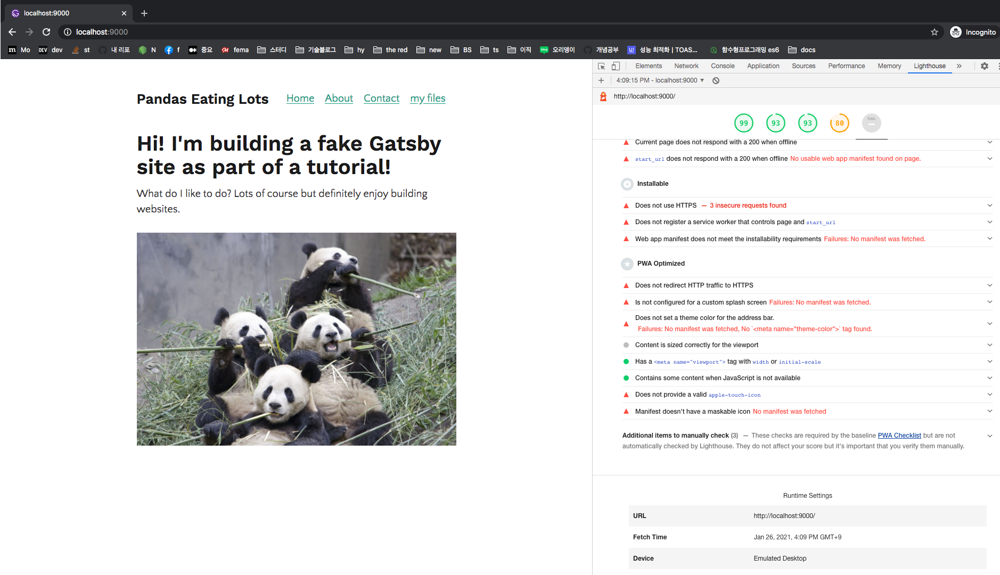

# gatsby-tutorial
Gatsby를 쓸일이 좀 있어서 공부하고 있습니다.

## [tutorial 페이지](https://www.gatsbyjs.com/docs/tutorial)
- [Gatsby Cli 설치](https://www.gatsbyjs.com/docs/tutorial/part-zero/#using-the-gatsby-cli): [Gatsby CLI란?](https://www.gatsbyjs.com/docs/reference/gatsby-cli/)
```
npm install -g gatsby-cli
```


## src/pages/*.js
- [Gatsby 분석](https://github.com/gatsbyjs/gatsby)
  
- 설치된 Gatsby 패키지 내의 index.js 파일(node_modules/gatsby/dist/query/index.js): 여기서 page 관련 처리를 하고 있다. 

```javascript
const processPageQueries = async (queryIds, {
  state,
  activity,
  graphqlRunner,
  graphqlTracing
}) => {
  state = state || store.getState(); // Make sure we filter out pages that don't exist. An example is
  // /dev-404-page/, whose SitePage node is created via
  // `internal-data-bridge`, but the actual page object is only
  // created during `gatsby develop`.
  console.log("process page queries")
  const pages = _.filter(queryIds.map(id => state.pages.get(id)));

  await processQueries(pages.map(page => createPageQueryJob(state, page)), {
    activity,
    graphqlRunner,
    graphqlTracing
  });
};
```

이렇게 page 폴더 안에 있는 무언가들을 바로 보여준다. 

- 브라우저에서는 어떻게 Page의 데이터를 보여주는가?
    - 일단 common.js 파일이 있다. 
        
    
    - `localhost:8080/about` 페이지를 요청하면 아래와 같은 `about.html`을 반환한다
  
    ```html
    <!DOCTYPE html><html><head><meta charSet="utf-8"/><meta http-equiv="x-ua-compatible" content="ie=edge"/><meta name="viewport" content="width=device-width, initial-scale=1, shrink-to-fit=no"/><meta name="note" content="environment=development"/><script src="/socket.io/socket.io.js"></script></head><body><div id="___gatsby"></div><script src="/polyfill.js" nomodule=""></script><script src="/commons.js"></script></body></html>
    ```

## Linking betwen pages
- Next.Js 도 글코 Link 가 어떻게 되는지 잘 이해가 안된다. 
- [Gatsby Link API docs](https://www.gatsbyjs.com/docs/reference/built-in-components/gatsby-link/#:~:text=Gatsby's%20component%20enables%20linking,user%20navigates%20with%20this%20component.&text=All%20props%20are%20passed%20through%20to%20%40reach%2Frouter's%20Link%20component.)
  - Gatsby의 `<Link>` 컴포넌트는 internal pages(내가 만드는 페이지)를 링크하고, preloading이라는 걸 한다. 
  - `preloading`이란? 리소스를 prefetch 위한 것으로 유저가 컴포넌트로 이동할때 이미 fetch 되어있도록. 
  - [IntersectionObserver](https://developer.mozilla.org/en-US/docs/Web/API/Intersection_Observer_API)(요소가 화면에 보이는지를 비동기적으로 볼수 있는 API, lazyloading 같은거할때 쓰인다!) 를 이용해서 low-priority request를 fetch한다. 즉 Link가 화면에 보일때 prefetch한다. 
  - `onMouseOver`는 high-priority request를 trigger하도록 했다. 왜냐하면 사용자가 해당 리소스로 접근할 확률이 높기때문이다. 
- `router`: https://reach.tech/router/api/Link


## Build
```
gatsby build
```

build 하면 public 폴더내에 관련 파일이 쭉 생긴다. public 폴더내로 이동한 후 http-server를 통해서 빌드가 된 것을 확인할 수 있다. 

```
http-server .
```

- 요청했을때 화면
  


화면을 보면 contact 파일관련해서도 이미 뭔가부르고 있음을 볼 수 있다. 실제로 Link 위에 마우스를 대는 순간 요청이 더 발생하는 것도 확인할 수 있다(prefetch 해오는 내용이 다른 것 같다)


<!-- TODO: https://www.gatsbyjs.com/docs/tutorial/part-two/ 

(개념쪽도 잘되있음)https://www.gatsbyjs.com/docs/conceptual/react-hydration/
(gatsby and typescript)https://www.gatsbyjs.com/docs/how-to/custom-configuration/typescript/
 -->

## Styling
```
├── package.json
├── src
│   └── pages
│       └── index.js
│   └── styles
│       └── global.css
```

- `gatsby-browser.js`: https://www.gatsbyjs.com/docs/reference/config-files/gatsby-browser/

  ```
  ├── package.json
  ├── src
  │   └── pages
  │       └── index.js
  │   └── styles
  │       └── global.css
  ├── gatsby-browser.js
  ```

- `css-modules` 가 default: https://github.com/css-modules/css-modules
  - .module.css 로 끝나야 gatsby 에서 css module로 인식된다


## Layout Componenet 사용하기
- [docs 참고](https://www.gatsbyjs.com/docs/tutorial/part-three/)
- Gatsby의 Plugin 이란?
  - `Gatsby plugins` are JavaScript packages that help add functionality to a Gatsby site.
  - Gatsby is designed to be extensible, which means plugins are able to extend and modify just about everything Gatsby does
  - [Gatsby Plugin library](https://www.gatsbyjs.com/plugins/)
  - Plugin은 Node.js 패키지중 Gatsby API를 따르는 것이다. `gatsby-config.js` 파일은 플러그인 리스트를 받는다. 어떤 플러그인은 이름만 써도 되고, 어떤 것들은 옵션들이 필요하다. 
  - `npm으로 플러그인을 설치한다고 Gatsby 사이트에서 바로 실행되는 것은 아니다` WOW
  - Plugin설치를 끝내기 위해서는 `gatsby-config.js파일에 꼭 써줘라`. 
  

## [Data in Gatsby](https://www.gatsbyjs.com/docs/tutorial/part-four/)
- 아마 여기가 멘탈 뽀가각 되는 챕터가 아닐까 싶구만.
- Gatsby의 Data Layer는 Gatsby의 아주 멋진 특징이고, 이걸 통해서 Markdown, Wordpress, headless CMSs, 그리고 다른 data source를 통해서 사이트를 만들 수 있다. 
- Gatsby의 Data Layersms `GraphQL`을 이용해서 동작한다: https://www.howtographql.com/
- Website는 네가지로 구성된다
  - HTML
  - CSS
  - JS
  - 그리고 `Data`
    - Gatsby의 `Data`란? __`React Component 밖의 모든 것(everything that lives outside of a React Component`__
    - Gatsby의 `Data Layer`란? __`Gatsby’s data layer lets you pull data from these (and any other source) directly into your components`__

### Gatsby의 데이터 레이어는 어떻게 GraphQL로 컴포넌트에 데이터를 가져오나?
- React 컴포넌트에 데이터를 가져오는 방법은 여러가지다

- [Page query 동작 원리](https://www.gatsbyjs.com/docs/how-to/querying-data/page-query/)

- Static Query: layout 컴포넌트처럼 페이지가 아닌 컴포넌트에서 데이터를 가져오는 API

- Page에서만 page query가 동작한다. Layout같은 non-page componenet는 static query를 사용해야한다
  - `gatsby-transformer-remark`: markdown 파일을 transform 하는 플러그인 


### Source plugins
- gatsby-source-filesystem: 파일에 대한 정보를 가져오는 플러그인
- transform plugins: 파일내의 내용에 대해 query 할 수 있도록 하는 플러그인
  - gatsby-transformer-remark

### Programmatically create pages from data
- `slug`란? A ‘slug’ is the unique identifying part of a web address, such as the /docs/tutorial/part-seven part of the page https://www.gatsbyjs.com/docs/tutorial/part-seven/

- 새로운 페이지를 만드는건 두단계로 일어난다
  - Generate the "path" or "slug" for the page
  - Create the page
- Markdown 페이지 생성을 위해서는 두개지 Gatsby API가 필요하다
  - onCreateNoe
  - createPages

- 어려워서 다시한번 보기: https://www.gatsbyjs.com/docs/tutorial/part-seven/


## Preparing a Site to Go Live
- [배포하기 전에 다 챙길것](https://www.gatsbyjs.com/docs/tutorial/part-eight/) 
- Audit with Lighthouse


이렇게 SEO등을 검사해서 올리면 된다!!

- PWA의 Manifest파일이란?
```
The web app manifest is a simple JSON file that tells the browser about your web application and how it should behave when ‘installed’ on the user’s mobile device or desktop.
```
